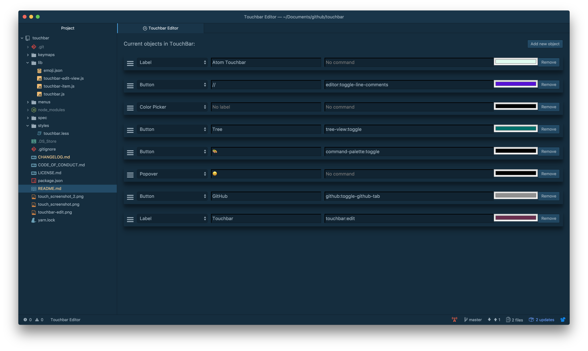

# touchbar package

Add touchbar elements to atom

## Installation
`apm install touchbar`

## How to use
Touchbar will be loaded on startup.
Press `ctrl-alt-o` to toggle touchbar

## Current shipped features:
- Labels
- Buttons
- Insert Text Buttons
- Color picker
- Emoji Picker
- Edit Touchbar
- Set Icons
- Insert Text (e.g. `{` or `[`). Please use `Button Text Insert` and insert your desired text in the command input


## How to change elements

There is now a basic editing function build in. Press the `Edit Touchbar` button on your Touchbar or go to `Packages -> touchbar -> Edit Touchbar`. You can choose the type of your element as well as the label, command and color.
Thanks to [@fand](https://github.com/fand) you can also add / remove and sort items in the edit view!



#### More advanced way:

Go to `Settings -> Packages -> touchbar` and update the `Elements` input. This input must be a valid json array of elements.

Example:

```js
[{"name":"color-picker","type":"color-picker"},{"name":"comment-button","type":"button","label":"//","command":"editor:toggle-line-comments","color":"#316ed4","icon":"","iconColor":"default"},{"name":"spacer","type":"button","size":"small","label":"","command":"tree-view:toggle","color":"#00716c","icon":"NSTouchBarSidebarTemplate","iconColor":"white"},{"name":"toggle-command-palette","type":"button","label":"🎨","command":"command-palette:toggle","iconColor":"default"},{"name":"toggle-github","type":"button","label":"GitHub","color":"#919191","command":"github:toggle-github-tab","icon":"","iconColor":"default"},{"name":"edit-touchbar","type":"button","label":"Touchbar","command":"touchbar:edit","color":"#6c233b"},{"type":"spacer","size":"flexible","name":"Config 1547128866278"},{"type":"button-insert","name":"Config 1545387178508","label":"[ ... ]","command":"[","icon":""},{"type":"button-insert","name":"Config 1545387144391","label":"{ ... }","command":"{"},{"type":"button-insert","name":"Config 1545390215291","label":"\\","command":"\\"}]
```
